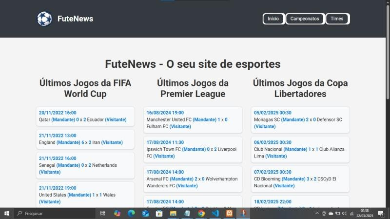
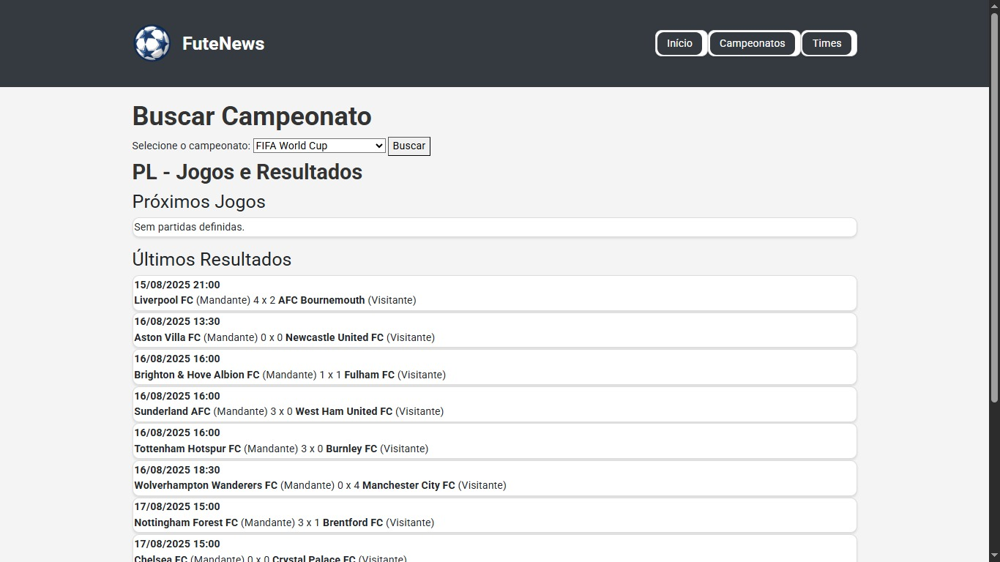
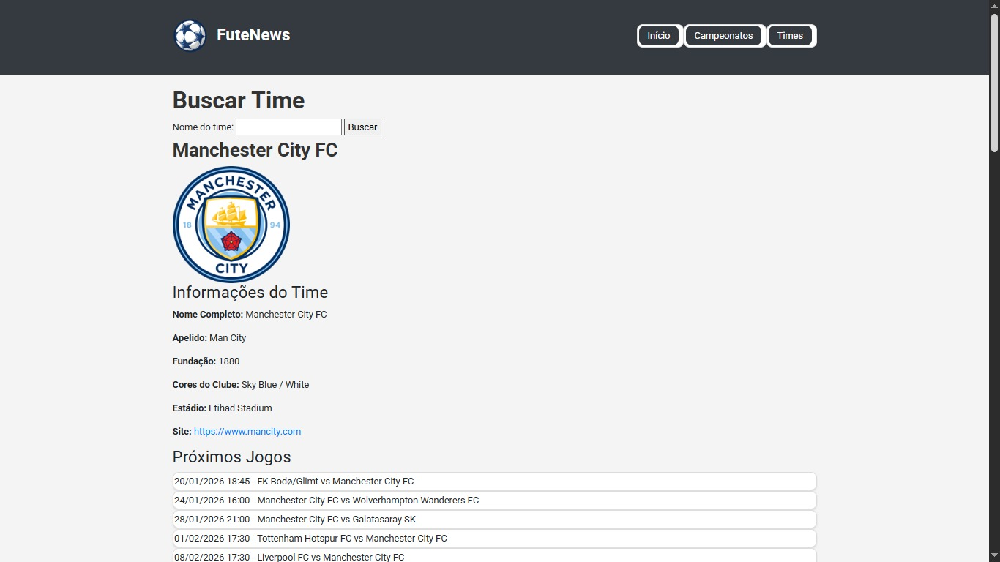

# ⚽ FuteNews — Portal de Futebol com Consumo de API

Projeto web em PHP que consome uma API pública de futebol para exibir **resultados recentes, próximos jogos, campeonatos e informações completas de times** em tempo real.

> 💡 Projeto desenvolvido com foco em estudo de integração com APIs, organização de código e boas práticas em aplicações web.

---

## 🔍 Visão Geral

O **FuteNews** permite que o usuário:

* Veja na **tela inicial** os últimos resultados dos principais campeonatos, com:

  * Nome dos times
  * Placar do jogo
  * Data e hora
  * Mandante e visitante

* Em **Campeonatos**:

  * Escolher qual campeonato deseja acompanhar
  * Visualizar próximos jogos e últimos resultados de cada competição

* Em **Times**:

  * Buscar pelo seu time favorito (ex: *Flamengo*, *Real Madrid*, *Manchester City*)
  * Visualizar:

    * Escudo do time
    * Nome completo
    * Cores
    * Estádio
    * Ano de fundação
    * Site oficial
    * Próximos jogos
    * Últimos resultados
    * Elenco (jogadores)

---

## 🖼️ Prints do Sistema

### Tela Inicial — Últimos Resultados



### Página de Campeonatos



### Página de Times



---

## 🛠️ Tecnologias Utilizadas

* **PHP 8+**
* **HTML5 / CSS3**
* **Bootstrap 4**
* **Composer** (gerenciador de dependências)
* **API Football-Data.org**

---

## ▶️ Como Executar o Projeto Localmente

### 1. Requisitos

* Ter o **XAMPP** (ou similar) instalado
* PHP 8+
* Composer instalado

---

### 2. Clonar o projeto

```bash
git clone https://github.com/rodrigoc-dev/site-futebol-api.git
```

---

### 3. Colocar na pasta correta

Mova a pasta do projeto para dentro de:

```
C:\xampp\htdocs\futebol
```

> ⚠️ Importante: o nome da pasta deve ser exatamente **futebol** para que os caminhos funcionem corretamente.

---

### 4. Instalar dependências

Dentro da pasta do projeto, execute:

```bash
composer install
```

---

### 5. Iniciar servidor

* Abra o XAMPP
* Inicie **Apache**

Acesse no navegador:

```
http://localhost/futebol/index.php
```

---

## 🔑 Observação sobre a API

Este projeto utiliza uma API pública de futebol que possui **limite de requisições**.

Caso apareça erro `429 (Too Many Requests)`:

* Aguarde alguns minutos e atualize a página
* Ou utilize uma nova chave de API no arquivo de configuração

---

## 🚀 Diferenciais do Projeto

* Consumo real de API externa
* Organização em pastas (`functions`, `templates`, `assets`)
* Interface amigável com Bootstrap
* Funcional em ambiente local
* Múltiplas telas integradas

---

## 👨‍💻 Autor

**Rodrigo Sousa de Castro**
Estudante de Análise e Desenvolvimento de Sistemas

📧 [rodrigo.castro1318@gmail.com](mailto:rodrigo.castro1318@gmail.com)
🔗 GitHub: [https://github.com/rodrigoc-dev](https://github.com/rodrigoc-dev)
🔗 LinkedIn: (www.linkedin.com/in/rodrigocastrodev)

---

> ✨ Projeto desenvolvido como parte da minha jornada para conquistar a primeira oportunidade como desenvolvedor. Feedbacks são muito bem-vindos!
